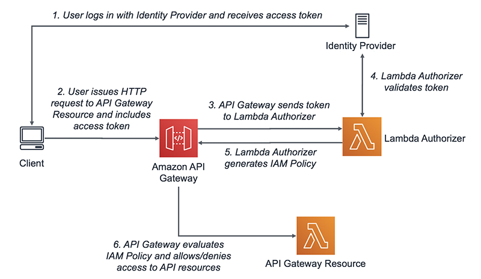
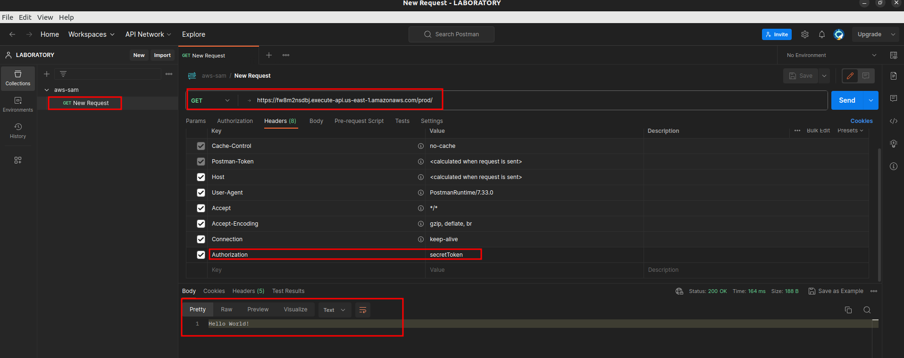

# Working with AWS Lambda authorizers for HTTP APIs
## Description
You use a Lambda authorizer to use a Lambda function to control access to your HTTP API. Then, when a client calls your API, API Gateway invokes your Lambda function. API Gateway uses the response from your Lambda function to determine whether the client can access your API.



## AWS SAM prerequisites
Complete the following prerequisites before installing and using the AWS Serverless Application Model Command Line Interface (AWS SAM CLI).

To use the AWS SAM CLI, you need the following:

- An AWS account, AWS Identity and Access Management (IAM) credentials, and an IAM access key pair.

- The AWS Command Line Interface (AWS CLI) to configure AWS credentials.


### Using the AWS SAM CLI

##### sam build
This command creates a .aws-sam directory that structures your application in a format and location that sam local and sam deploy require.
```bash
sam build
 ```   
##### sam deploy
Use the AWS Serverless Application Model Command Line Interface (AWS SAM CLI) sam deploy command to deploy your serverless application to the AWS Cloud.
```bash
sam deploy --guided
```
#####

### Postman
Postman is an HTTP-based application that tests APIs through a graphical user interface (GUI). You use commands like GET, POST, and DELETE to get interaction results that you can then validate.
#### Endpoint
```bash
https://${MyApi}.execute-api.${AWS::Region}.amazonaws.com/prod/
```

##### Headers
```bash
Authorization = secretToken
```




##### sam deploy
Deletes an AWS SAM application by deleting the AWS CloudFormation stack, the artifacts that were packaged and deployed to Amazon S3 and Amazon ECR, and the AWS SAM template file.

```bash
sam delete
```